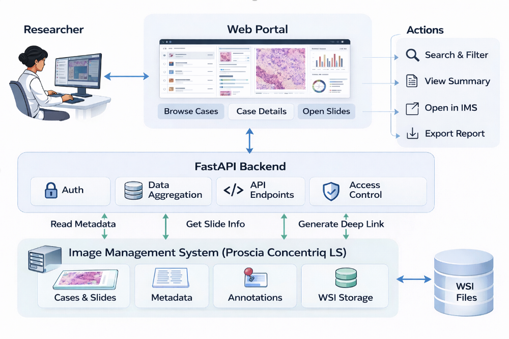

# Digital Pathology Web Portal Demo

This demo explores how case-level clinical meta-data and slide-level information can be unified within a single pathology review interface.
The current implementation combines a static frontend, FastAPI backend, AWS S3 asset storage, and OpenSeadragon-based whole-slide image viewing.
<a href="https://jaeseung-lee-engineer.github.io/prototype.html" target="_blank">
Open the Digital Pathology Demo Portal
</a>

## High-level architecture:

This system design demonstrates a conceptual integration with Qupath and an Image Management System (IMS) such as Proscia Concentriq LS.

This demo now includes a lightweight FastAPI backend deployed separately from the static frontend. The current implementation uses an API-first metadata flow, falls back to AWS S3 if the API is unavailable, and streams slide assets directly from S3.

Current API endpoints:

GET /health  
GET /cases  
GET /cases/{case_id}  
GET /portal-data  

Additional API structure that could be expanded in a real-world deployment:

GET /slides/{slide_id}  
POST /annotations  

## Interface

- Slide Viewer — Whole-slide image visualization  
- Case Details — Clinical metadata  
- Linked Slides — Navigation across slides  
- Slide Details — Quantitative metrics & notes  
- Annotation Toggle — Region highlighting (by Pathologists or AI software)

## QuPath Workflow Continuity

To support downstream pathology review beyond the browser-based viewer, the portal includes export features designed to preserve workflow continuity into QuPath.

- SVS Source Download — downloads the original whole-slide SVS file from AWS S3 so review can continue in external tools such as QuPath without breaking workflow continuity
- QuPath Package Download — exports a handoff ZIP that includes `slide-info.json`, `roi.geojson`, `open_in_qupath.groovy`, `README.txt`, and `svs-url.txt`
- ROI Handoff — preserves saved ROI geometry in image pixel coordinates so reviewer-selected regions can be recreated inside QuPath
- Review Context Preservation — carries slide identifiers, case summary metadata, and source SVS link forward into the downstream analysis step
- Current implementation stores ROI client-side in localStorage for lightweight review continuity.

## AWS S3
- case-data.json
- thumbnail images
- DZI files
- DZI tile JPEGs
- source SVS files
  
## IMS Integration

Designed to conceptually support retrieval of:
- Whole-slide images (WSI)
- Case metadata
- Slide details
- Annotation layers

## Tech Stack

- HTML/CSS/JavaScript
- FastAPI
- OpenSeadragon
- AWS S3
- Render

## Disclaimer

- Demo uses publicly available TCGA data
- Non-clinical demonstration
- For interface and workflow illustration only
- Not for medical use

## Reference 

- Pedano, N., Flanders, A. E., Scarpace, L., Mikkelsen, T., Eschbacher, J. M., Hermes, B., Sisneros, V., Barnholtz-Sloan, J., & Ostrom, Q. (2016). The Cancer Genome Atlas Low Grade Glioma Collection (TCGA-LGG) (Version 3) [Data set]. The Cancer Imaging Archive. https://doi.org/10.7937/K9/TCIA.2016.L4LTD3TK

## Acknowledgement

- This demo is based, in whole or in part, on data generated by the TCGA Research Network: http://cancergenome.nih.gov/
